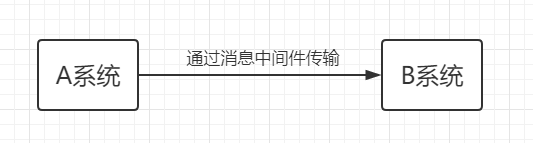
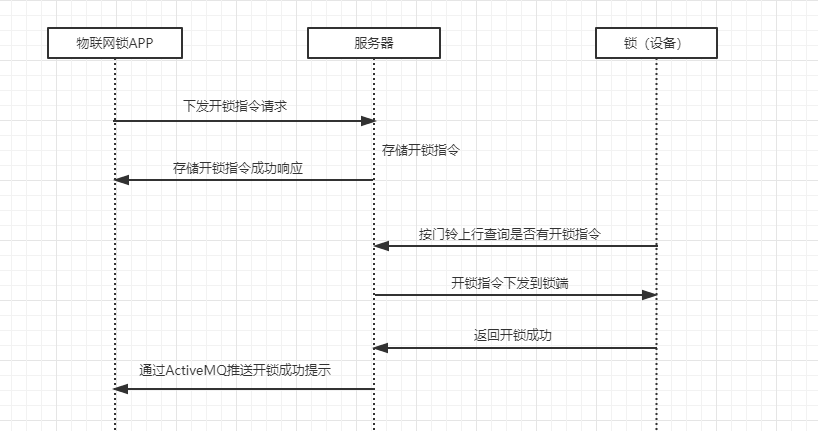
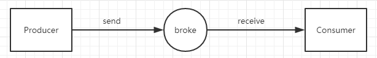

# activeMQ
**一、什么是消息中间件**

消息中间件顾名思义实现的就是在两个系统或两个客户端之间进行消息传送

**二、什么是ActiveMQ**

ActiveMQ是一种开源的基于JMS（Java Message Servie）规范的一种消息中间件的实现，ActiveMQ的设计目标是提供标准的，面向消息的，能够跨越多语言和多系统的应用集成消息通信中间件。
**三、什么时候需要用ActiveMQ**

ActiveMQ常被应用与系统业务的解耦，异步消息的推送，增加系统并发量，提高用户体验。例如以我在工作中的使用，在比较耗时且异步的远程开锁操作时

**四、如何使用ActiveMQ**

1.AcitveMQ的数据传送流程

2.ActiveMQ的两种消息传递类型

（1）点对点传输，即一个生产者对应一个消费者，生产者向broke推送数据，数据存储在broke的一个队列中，当消费者接受该条队列里的数据。

（2）基于发布/订阅模式的传输，即根据订阅话题来接收相应数据，一个生产者可向多个消费者推送数据，与MQTT协议的实现是类似的，对MQTT协议有兴趣的可跳转到https://www.cnblogs.com/xiguadadage/p/11216463.html

两种消息传递类型的不同，点对点传输消费者可以接收到在连接之前生产者所推送的数据，而基于发布/订阅模式的传输方式消费者只能接收到连接之后生产者推送的数据。