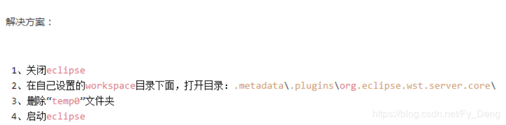

# 报错统计
**1，错误提示：Tomcat启动报错：Could not publish to server. java.lang.NullPointerException**

当时我按照网上百度的方法去解决，后来结果还是一样，然后我把那个temp0的文件夹特地备份了，又给他放到了原位置，再重新启动Tomcat，突然就好了，所以配置文件这东西一定要备份！！不只是平常用的其他开发软件，其他的都有必要！
**删除temp0后解决问题**