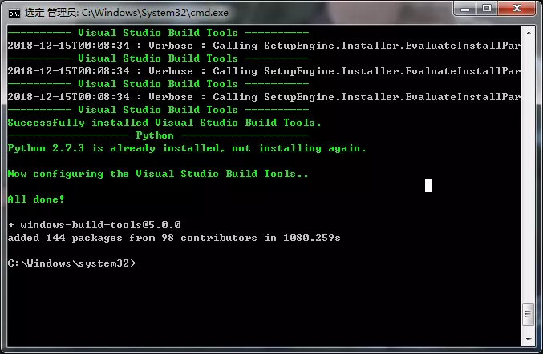

### 一
 在github上下了一套springboot+vue+shiro的项目   
 项目名 **SpringBoot-Shiro-Vue**
 成功VSCode跑起来了一个vue项目
 流程：
 ```
 npm install
 npm run dev
 ```
 遇到问题总结：
在npm install的时候遇到没有python环境问题
```
需要用管理员运行命令行执行
npm install --global --production windows-build-tools
```
结果图


### 二
关于maven的父子聚合项目问题
**在父模块中**
```
<packaging>pom</packaging>
<modules>
        <module>
            XXXX
        </module>
<modules>
```
**子模块中**
```
<packaging>jar</packaging>
<parent>
    添加父groupid等等
</parent>
```
这样子模块打包可以直接一起打包进去，也可以直接将父模块的一系列modules引入使用，避免需要pom中加dependency。
