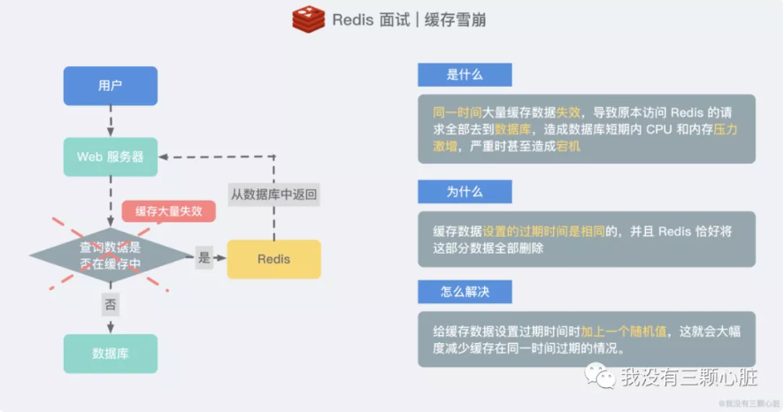
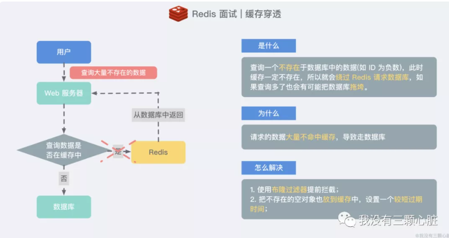
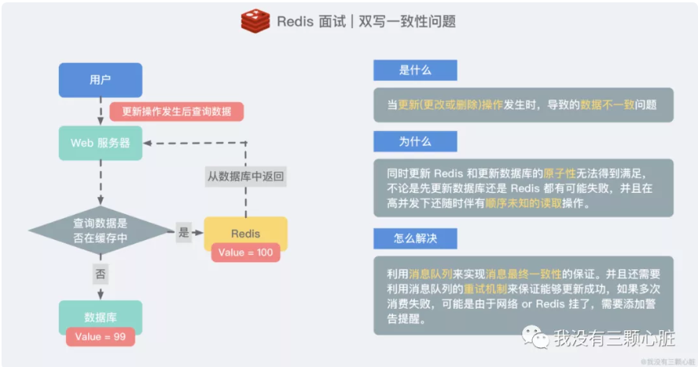
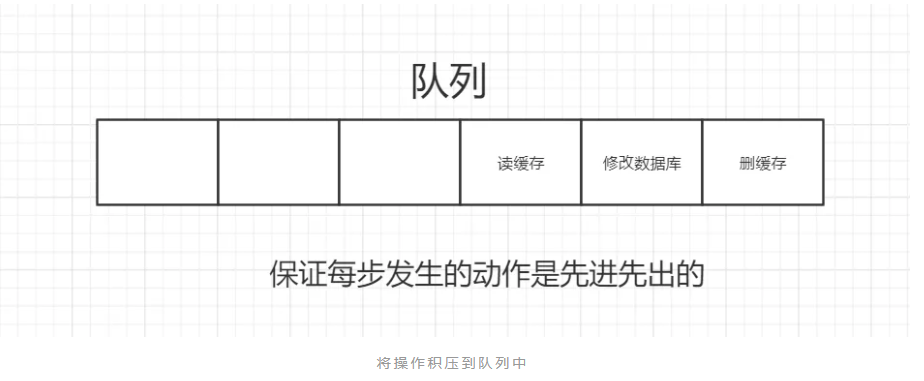

# redis
### 缓存雪崩问题

```
另外对于 "Redis 挂掉了，请求全部走数据库" 这样的情况，我们还可以有如下的思路：
事发前：实现 Redis 的高可用(主从架构 + Sentinel 或者 Redis Cluster)，尽量避免 Redis 挂掉这种情况发生。
事发中：万一 Redis 真的挂了，我们可以设置本地缓存(ehcache) + 限流(hystrix)，尽量避免我们的数据库被干掉(起码能保证我们的服务还是能正常工作的)
事发后：Redis 持久化，重启后自动从磁盘上加载数据，快速恢复缓存数据。
```
### 缓存穿透问题

### 缓存与数据库双写一致问题

**3.1对于读操作，流程是这样的**
```
上面讲缓存穿透的时候也提到了：如果从数据库查不到数据则不写入缓存。
一般我们对读操作的时候有这么一个固定的套路：
如果我们的数据在缓存里边有，那么就直接取缓存的。
如果缓存里没有我们想要的数据，我们会先去查询数据库，然后将数据库查出来的数据写到缓存中。
最后将数据返回给请求
```
**3.2什么是缓存与数据库双写一致问题？**
```
如果仅仅查询的话，缓存的数据和数据库的数据是没问题的。但是，当我们要更新时候呢？各种情况很可能就造成数据库和缓存的数据不一致了。
这里不一致指的是：数据库的数据跟缓存的数据不一致

数据库和缓存的数据不一致
从理论上说，只要我们设置了键的过期时间，我们就能保证缓存和数据库的数据最终是一致的。因为只要缓存数据过期了，就会被删除。随后读的时候，因为缓存里没有，就可以查数据库的数据，然后将数据库查出来的数据写入到缓存中。
除了设置过期时间，我们还需要做更多的措施来尽量避免数据库与缓存处于不一致的情况发生。
```
**3.3对于更新操作**
```
一般来说，执行更新操作时，我们会有两种选择：
先操作数据库，再操作缓存
先操作缓存，再操作数据库
首先，要明确的是，无论我们选择哪个，我们都希望这两个操作要么同时成功，要么同时失败。所以，这会演变成一个分布式事务的问题。
所以，如果原子性被破坏了，可能会有以下的情况：
操作数据库成功了，操作缓存失败了。
操作缓存成功了，操作数据库失败了。
如果第一步已经失败了，我们直接返回Exception出去就好了，第二步根本不会执行。
下面我们具体来分析一下吧。
```
**3.3.1操作缓存 **
```
操作缓存也有两种方案：
更新缓存
删除缓存
一般我们都是采取删除缓存缓存策略的，原因如下：
高并发环境下，无论是先操作数据库还是后操作数据库而言，如果加上更新缓存，那就更加容易导致数据库与缓存数据不一致问题。(删除缓存直接和简单很多)
如果每次更新了数据库，都要更新缓存【这里指的是频繁更新的场景，这会耗费一定的性能】，倒不如直接删除掉。等再次读取时，缓存里没有，那我到数据库找，在数据库找到再写到缓存里边(体现懒加载)
基于这两点，对于缓存在更新时而言，都是建议执行删除操作！
```
**3.3.2先更新数据库，再删除缓存** 
```
正常的情况是这样的：
先操作数据库，成功；
再删除缓存，也成功；
如果原子性被破坏了：
第一步成功(操作数据库)，第二步失败(删除缓存)，会导致数据库里是新数据，而缓存里是旧数据。
如果第一步(操作数据库)就失败了，我们可以直接返回错误(Exception)，不会出现数据不一致。
如果在高并发的场景下，出现数据库与缓存数据不一致的概率特别低，也不是没有：
缓存刚好失效
线程A查询数据库，得一个旧值
线程B将新值写入数据库
线程B删除缓存
线程A将查到的旧值写入缓存
要达成上述情况，还是说一句概率特别低：
因为这个条件需要发生在读缓存时缓存失效，而且并发着有一个写操作。而实际上数据库的写操作会比读操作慢得多，而且还要锁表，而读操作必需在写操作前进入数据库操作，而又要晚于写操作更新缓存，所有的这些条件都具备的概率基本并不大。
对于这种策略，其实是一种设计模式：Cache Aside Pattern

先修改数据库，再删除缓存
删除缓存失败的解决思路：
将需要删除的key发送到消息队列中
自己消费消息，获得需要删除的key
不断重试删除操作，直到成功
```
**3.3.3先删除缓存，再更新数据库 **
```
正常情况是这样的：
先删除缓存，成功；
再更新数据库，也成功；
如果原子性被破坏了：
第一步成功(删除缓存)，第二步失败(更新数据库)，数据库和缓存的数据还是一致的。
如果第一步(删除缓存)就失败了，我们可以直接返回错误(Exception)，数据库和缓存的数据还是一致的。
看起来是很美好，但是我们在并发场景下分析一下，就知道还是有问题的了：
线程A删除了缓存
线程B查询，发现缓存已不存在
线程B去数据库查询得到旧值
线程B将旧值写入缓存
线程A将新值写入数据库
所以也会导致数据库和缓存不一致的问题。
并发下解决数据库与缓存不一致的思路：
将删除缓存、修改数据库、读取缓存等的操作积压到队列里边，实现串行化。
```

**3.4对比两种策略**
```
我们可以发现，两种策略各自有优缺点：
先删除缓存，再更新数据库
在高并发下表现不如意，在原子性被破坏时表现优异
先更新数据库，再删除缓存(Cache Aside Pattern设计模式)
在高并发下表现优异，在原子性被破坏时表现不如意
```